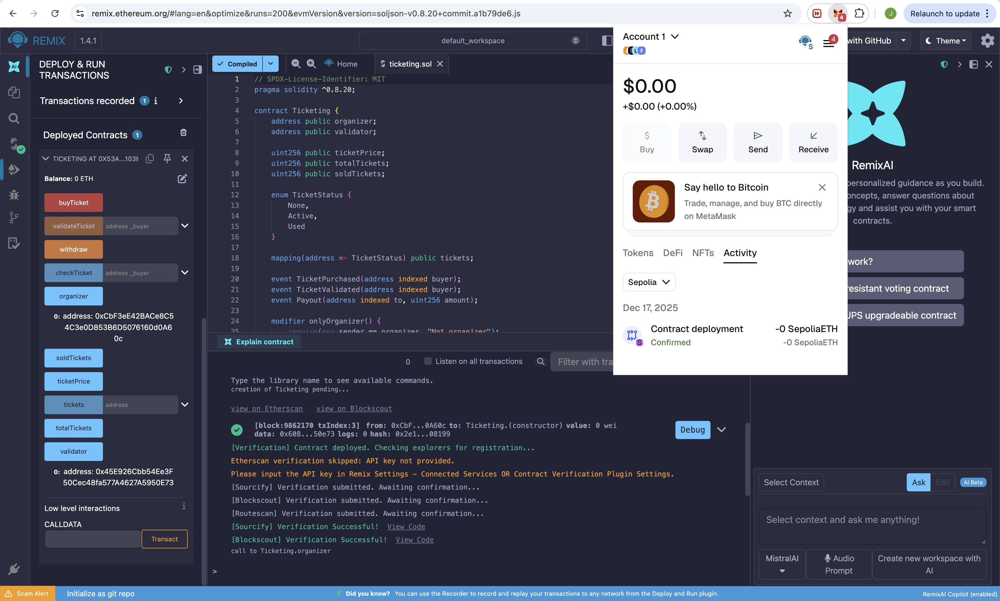
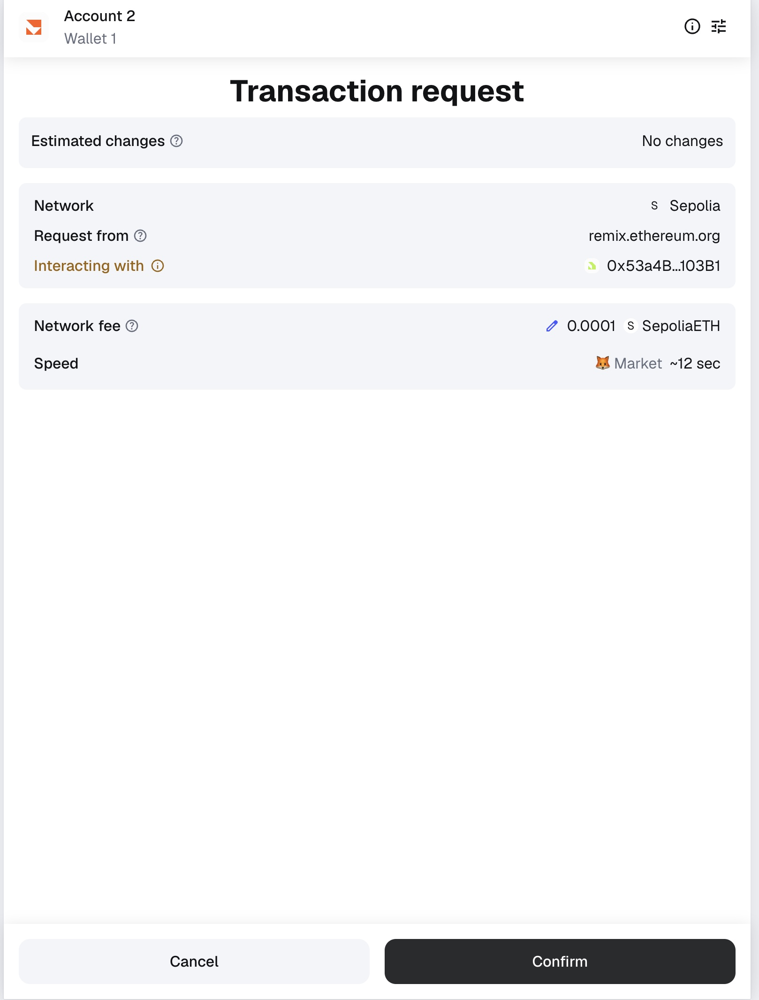
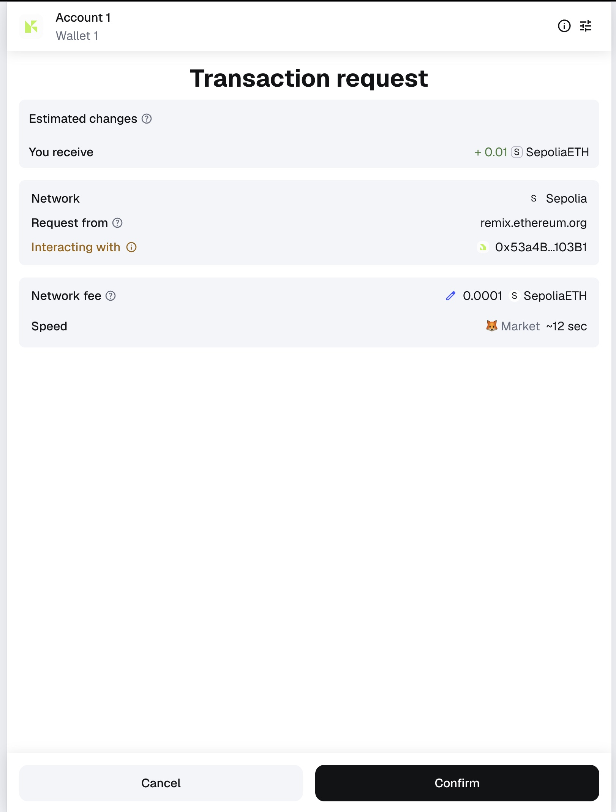
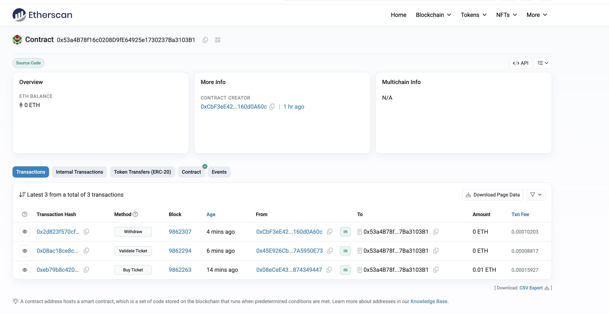
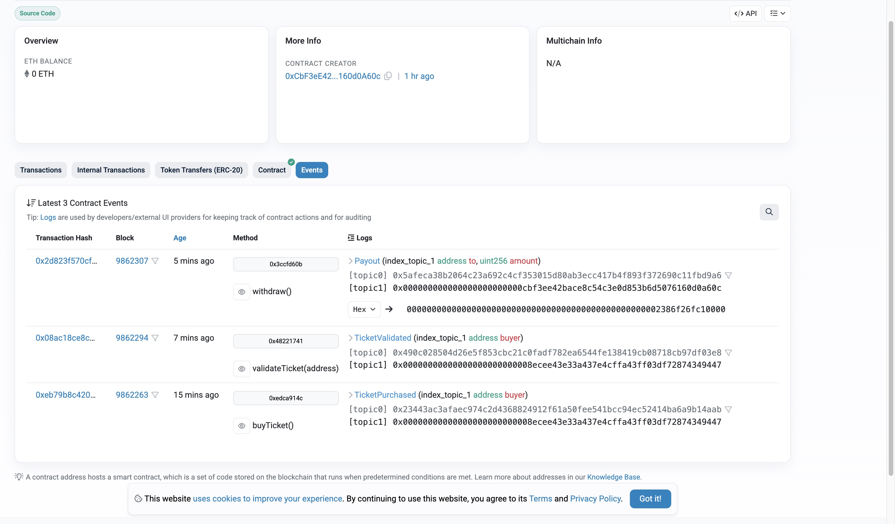

# 4-uzduotis

## Išmanioji sutartis „Ticketing“

## 1. Apžvalga
Šiame projekte sukūriau Ethereum išmaniąją sutartį **„Ticketing“**, kuri leidžia vartotojams pirkti ir validuoti bilietus decentralizuotoje aplinkoje. Galutinė sistemos versija buvo sukurta ir ištestuota naudojant **Remix VM (Shanghai)** — vidinę virtualią blokų grandinę.

---

## 2. Pradiniai bandymai (Truffle + Ganache + MetaMask)
Pradžioje bandžiau naudoti:

- Truffle
- Ganache
- MetaMask

Tačiau realus deploy per Truffle nepavyko dėl gas skaičiavimo klaidų ir suderinamumo problemų su mano Node versija.  

---

## 3. Galutinis pasirinkimas — Remix VM (Shanghai)
Tolimesnis darbas atliktas naudojant Remix IDE:

Environment: Remix VM (Shanghai)

**Žingsniai:**
1. Įkėliau `Ticketing.sol` failą į Remix.  
2. Su `Solidity Compiler` sukompiliavau kontraktą (0.8.20).  
3. Pasirinkau **Remix VM (Shanghai)** kaip vykdymo aplinką.  
4. Įvedžiau konstruktoriaus parametrus:
   - `ticketPrice = 1 ether`
   - `totalTickets = 100`
   - `validator = vienas iš VM sugeneruotų adresų`
5. Paspaudžiau **Deploy** — kontraktas sėkmingai įdiegtas.

---

## 4. Funkcionalumo testavimas

### 4.1 Bilieto pirkimas (`buyTicket`)
- Pasirinkau kitą VM paskyrą kaip **pirkėją**.  
- Į lauką **Value** įrašiau `1 ether`.  
- Iškviečiau funkciją `buyTicket()`.  
- Rezultatai:
  - `tickets(buyer) = 1 (Active)`  
  - Remix konsolėje užregistruotas `TicketPurchased` įvykis

### 4.2 Bilieto validavimas (`validateTicket`)
- Persijungiau į paskyrą, nurodytą kaip **validator**.  
- Iškviečiau `validateTicket(buyer)`.  
- Rezultatai:
  - `tickets(buyer) = 2 (Used)`  
  - Konsolėje matomas `TicketValidated` įvykis

## 5. Išmaniosios sutarties testavimas Ethereum testiniame tinkle (Sepolia)

Naudojau:
- **MetaMask**
- **Remix (Injected Provider – MetaMask)**
- **Sepolia testinius ETH**

Buvo atlikti šie veiksmai:
- Prijungtas MetaMask prie Sepolia tinklo
- Gauti testiniai SepoliaETH per „faucet“
- Remix aplinkoje pasirinktas „Injected Provider – MetaMask“
- Išmanioji sutartis sėkmingai įdiegta (deploy) į Sepolia tinklą
- Atlikti veiksmai per Remix ir MetaMask:
  - Bilieto pirkimas (`buyTicket`) su ETH verte
  - Bilieto validavimas naudojant validatoriaus adresą
  - Lėšų išėmimas organizatoriui (`withdraw`)

Visi veiksmai buvo patvirtinti per MetaMask ir įtraukti į Sepolia blokų grandinę.

Kontractas deployed: 
 

Bilietas validuotas: 
 

Organizatorius pasiemė pinigus: 
 

---

## 6. Išmaniosios sutarties „logų“ peržiūra naudojant Etherscan

Išmaniosios sutarties veikimas buvo patikrintas naudojant **Sepolia Etherscan**.

Etherscan matomi šie įvykiai (event’ai):
- `TicketPurchased` – bilieto pirkimas
- `TicketValidated` – bilieto validavimas
- `Payout` – lėšų išmokėjimas organizatoriui

---

## Verslo modelio ir logikos aprašymas
1. Įvadas
Pasirinktas verslo modelis realizuoja decentralizuotą bilietų pardavimo ir validavimo sistemą. Šios sistemos tikslas – užtikrinti skaidrų, patikimą ir nekintamą bilietų pardavimo procesą, pasitelkiant išmaniąją sutartį Ethereum tinkle. Sprendimas eliminuoja tarpininkus, padidina pasitikėjimą tarp dalyvių ir užtikrina, kad bilietų pirkimo bei patvirtinimo duomenys būtų vieši, tikslūs ir nekeičiami.
Sistema naudoja Ethereum išmaniąją sutartį (Smart Contract), sukurtą Solidity kalba, ir decentralizuotą aplikaciją (DApp), kuri leidžia vartotojams sąveikauti su kontraktu per patogią vartotojo sąsają.
 
2. Verslo modelio veikėjai
Organizatorius
Tai renginio savininkas, kuris:
- sukuria renginį,
- nurodo bilieto kainą ir bilietų kiekį,
- paskiria validatoriaus adresą,
- po renginio pasiima surinktas lėšas iš išmaniosios sutarties.
Organizatorius yra kontrakto diegėjas (contract owner).
 
Pirkėjas
Tai bet kuris vartotojas, norintis įsigyti bilietą.
Pirkėjas:
- prisijungia prie DApp per MetaMask,
- atlieka saugų bilieto pirkimą siųsdamas ETH į išmaniąją sutartį,
- gauna patvirtinimą, kad jam priklauso bilietas.
Pirkėjo bilieto turėjimas saugomas kontrakto būsenos kintamuosiuose.
 
Validatorius
Tai renginio darbuotojas, atsakingas už dalyvių bilietų tikrinimą prie įėjimo.
Validatorius:
- gauna specialias teises validuoti bilietus,
- pažymi bilietą kaip panaudotą,
- užtikrina, kad tas pats bilietas nebūtų panaudotas antrą kartą.
Validatoriaus adresą nurodo organizatorius kontrakto kūrimo metu.

------------------------------------

## Sekos diagrama

1. Deploy
Organizatorius įkelia („deploy“) išmaniąją sutartį į Ethereum tinklą, nurodydamas bilieto kainą, maksimalų bilietų kiekį ir validatoriaus adresą. Kontraktas išsaugo organizatorių kaip sutarties savininką.
 
2. Buy ticket
Pirkėjas inicijuoja bilieto įsigijimą iškviesdamas funkciją buyTicket().

3. Check ticket
Renginio dieną validatorius patikrina, ar lankytojo adresas turi galiojantį bilietą, iškviesdamas smart contract funkciją, kuri grąžina hasTicket(address) reikšmę.
 
4. Validate ticket
Jeigu bilietas yra galiojantis, validatorius iškviečia validateTicket(address) funkciją.
 
6. Ticket validated [event]
Kontraktas pažymi bilietą kaip panaudotą (hasTicket[address] = false) ir išleidžia TicketValidated event’ą. Tai signalas validatoriaus sistemai, kad bilietas buvo panaudotas ir nebegali būti panaudotas dar kartą.
 
7. Withdraw
Pasibaigus renginiui organizatorius iškviečia funkciją withdraw() norėdamas atsiimti visą kontrakte sukauptą ETH sumą.
 
8. Payout
Kontraktas patikrina, kad lėšas bando atsiimti būtent organizatorius (msg.sender == organizer). Jeigu taip, kontraktas perveda visą savo balansą į organizatoriaus Ethereum adresą.

